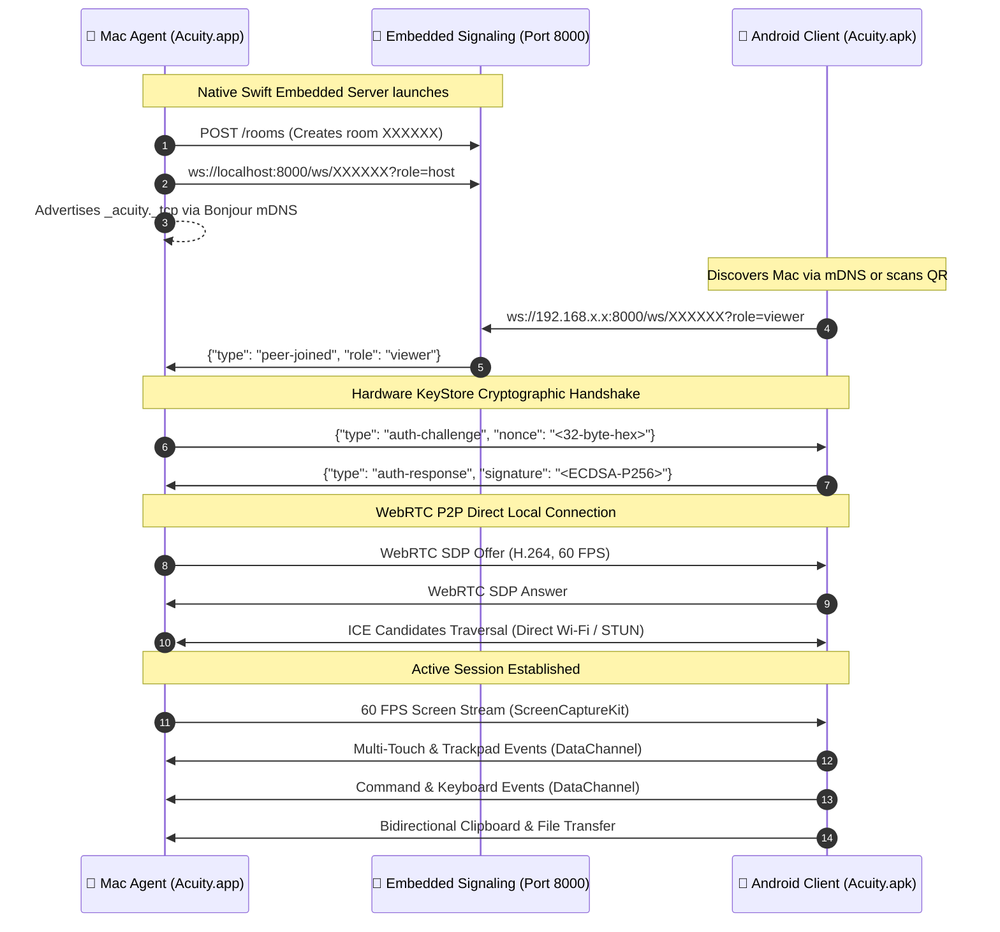

<div align="center">

# ⚡️ Acuity
### Ultra-Low Latency Mac Screen Mirroring & Hardware Remote Control for Android

[](https://github.com/shashanthnetha/Acuity-control-mac-through-mobile-/releases)
[](https://github.com/shashanthnetha/Acuity-control-mac-through-mobile-/stargazers)
[](LICENSE)
[](https://github.com/shashanthnetha/Acuity-control-mac-through-mobile-/releases)
[-3DDC84?style=for-the-badge&logo=android&logoColor=white)](https://github.com/shashanthnetha/Acuity-control-mac-through-mobile-/releases)
[](https://github.com/shashanthnetha/Acuity-control-mac-through-mobile-)

<p align="center">
  <b>Turn your Android phone or tablet into an ultra-responsive secondary display, multi-touch trackpad, and remote hardware keyboard for your Mac.</b><br>
  Powered by <b>Apple ScreenCaptureKit</b>, <b>Native WebRTC H.264 hardware encoding</b>, and <b>CoreGraphics event taps</b>.
</p>

[📥 Download Acuity for Mac (.dmg)](https://github.com/shashanthnetha/Acuity-control-mac-through-mobile-/releases/latest/download/Acuity.dmg) &nbsp;•&nbsp; [📱 Download Acuity for Android (.apk)](https://github.com/shashanthnetha/Acuity-control-mac-through-mobile-/releases/latest/download/acuity.apk) &nbsp;•&nbsp; [📖 Documentation](#-how-to-use)

</div>

---

## ⚠️ Prerequisite (Important)

> [!IMPORTANT]
> **Both your Mac and Android phone must be connected to the SAME Wi-Fi network** (or on the same **Tailscale** private mesh network if connecting across different houses/internet).
> 
> Acuity streams video directly **peer-to-peer (P2P)** over your local Wi-Fi router. No video or screen data ever leaves your local network or passes through any cloud servers.

---

## 🌟 Key Highlights

* **⚡ Sub-16ms Local Latency at 60 FPS**: Leverages Apple's private `ScreenCaptureKit` pipeline with native VideoToolbox H.264 hardware encoding. Silky smooth 60 frames per second over direct local WebRTC.
* **⌨️ Mac Command Bar & Keyboard Drawer**: Bottom-docked slide-up command bar that floats above your keyboard without blocking the Mac screen.
  * **Sticky Modifiers**: `⌘ CMD`, `⌥ OPT`, `⌃ CTRL`, and `⇧ SHIFT` with glowing active states.
  * **macOS Function Keys**: `ESC`, `TAB ⇥`, `SPACE`, `⌫ DEL`, and `↵ RET`.
  * **One-Tap Shortcuts**: Quick chips for `⌘ Space` (Spotlight), `⌘C`, `⌘V`, `⌘Z`, `⌘W`, `⌘Q`, and `⌘Tab`.
  * **4-Way Arrow Keypad**: Dedicated `◀` `▲` `▼` `▶` navigation pad for code, slide decks, and terminal command history.
* **👆 Fluid Trackpad & Multi-Touch Gestures**:
  * Tap for Left-Click, two-finger tap for Right-Click.
  * Two-finger vertical drag for smooth inertial scrolling with natural direction.
  * Long-press and drag for window moving and text selection with built-in safety watchdog.
  * Customizable cursor acceleration multipliers (`0.75x`, `1.0x`, `1.5x`, `2.0x`).
* **📡 Zero-Config Embedded Signaling & Bonjour**: Acuity embeds its own native Swift WebSocket signaling server directly inside the Mac menu-bar daemon. **No Terminal commands, no Python scripts, no configuration files**.
* **🔒 Cryptographic Android KeyStore Authentication**: Hardware-backed Android KeyStore P-256 ECDSA challenge-response handshake prevents unauthorized devices from connecting.
* **📋 Bidirectional Clipboard & 📁 Chunked File Transfer**: Push clipboard text directly into the macOS pasteboard and send files via chunked WebRTC DataChannels.
* **🔋 Low-Bandwidth Mode**: Switch to dynamic low-bandwidth mode (1.5 Mbps, 15 FPS) on congested networks with one tap on the control dock.

---

## 🚀 Quick Download

| Platform | Format | System Requirements | Direct Download |
| :--- | :--- | :--- | :--- |
| **macOS** | `.dmg` Installer | macOS 13.0+ (Ventura, Sonoma, Sequoia) • Apple Silicon & Intel | [**Download Acuity.dmg**](https://github.com/shashanthnetha/Acuity-control-mac-through-mobile-/releases/latest/download/Acuity.dmg) |
| **Android** | `.apk` Package | Android 8.0+ (API 26+) • Phone or Tablet | [**Download acuity.apk**](https://github.com/shashanthnetha/Acuity-control-mac-through-mobile-/releases/latest/download/acuity.apk) |

---

## 📖 How to Use

### Step 1: Install on Mac
1. Download [**`Acuity.dmg`**](https://github.com/shashanthnetha/Acuity-control-mac-through-mobile-/releases/latest/download/Acuity.dmg).
2. Open the disk image and drag **Acuity** into your **Applications** folder.
3. Open **Acuity** from Applications.
4. When prompted by macOS, grant the two required system permissions:
   * **Screen Recording**: Required by ScreenCaptureKit to stream display frames.
   * **Accessibility**: Required by CoreGraphics to inject mouse and keyboard inputs.
5. The Acuity icon will appear in your top macOS menu bar with an active **6-character Room Code** and a clickable **QR code**.

### Step 2: Install on Android
1. Download and open [**`acuity.apk`**](https://github.com/shashanthnetha/Acuity-control-mac-through-mobile-/releases/latest/download/acuity.apk) on your Android device.
   *(Allow "Install unknown apps" from your browser if prompted).*
2. Open **Acuity**.
3. Ensure your phone is connected to the **same Wi-Fi network** as your Mac.

### Step 3: Connect
* **Method A (QR Code)**: Tap **Scan QR** in the Android app and point your camera at the Mac menu bar's QR code.
* **Method B (Auto-Discovery)**: Look at the **Discovered Devices** list on the home screen; your Mac will appear automatically via Bonjour mDNS. Tap it to connect!
* **Method C (Manual)**: Type the 6-character room code shown in your Mac menu bar into the Android input box and tap **Connect**.

---

## 🌐 Remote Connection (Across the Internet)

If your Mac and Android device are on different Wi-Fi networks (e.g. you are away from your desk or sharing with a friend remotely):

1. Install [**Tailscale**](https://tailscale.com) (free) on both your Mac and Android phone.
2. Sign into both devices with the same Tailscale account.
3. In the Android app, expand **Direct IP Configuration**, enter your Mac's 100.x.y.z Tailscale IP, and tap **Connect**.
4. Enjoy sub-50ms encrypted peer-to-peer remote control from anywhere in the world!

---

## 🏗️ Architecture & Protocol



---

## 📊 Comparison with Existing Solutions

| Feature | Acuity | Apple Sidecar | Deskreen | TeamViewer / AnyDesk |
| :--- | :---: | :---: | :---: | :---: |
| **Android Support** | ✅ **Native** | ❌ (iPad only) | ⚠️ (Browser only) | ⚠️ (Heavy latency) |
| **Latency** | ⚡ **<16ms (P2P)** | ⚡ <16ms | ⚠️ 80-150ms | ❌ 100-300ms |
| **Embedded Signaling** | ✅ **Zero Setup** | N/A | ❌ Requires Node | ❌ Cloud account |
| **Hardware Modifiers (`⌘`, `⌥`, `⌃`, `⇧`)** | ✅ **Native Drawer** | ❌ | ❌ | ⚠️ Clunky |
| **Touch to Mac Cursor** | ✅ **CoreGraphics** | ❌ (Apple Pencil only)| ❌ (View only) | ⚠️ Emulated |
| **Open Source & Free** | ✅ **100% MIT** | ❌ Proprietary | ⚠️ Inactive | ❌ Paid / Commercial |
| **No Internet Required** | ✅ **100% Local** | ✅ Local | ✅ Local | ❌ Requires Cloud |

---

## 🛠️ Tech Stack & Implementation Details

* **macOS Host (`mac-agent`)**:
  * **Language**: Swift 5.9+ (Native Cocoa / AppKit)
  * **Capture Engine**: Apple `ScreenCaptureKit` with zero-copy CMSampleBuffer frames
  * **Video Encoding**: Native WebRTC C++ framework with VideoToolbox hardware H.264
  * **Input Engine**: Quartz `CGEvent` and CoreGraphics event taps (`.cghidEventTap`)
  * **Signaling**: Native `Network.framework` `NWListener` + `CryptoKit` WebSocket engine
  * **Packaging**: Single zero-dependency `.app` bundle and drag-and-drop `.dmg` disk image
* **Android Client (`android-client`)**:
  * **Language**: Kotlin 2.0+
  * **UI Framework**: Modern Jetpack Compose with Material 3 Dark Technical Design System
  * **WebRTC**: Google WebRTC Android SDK (`stream-webrtc-android`)
  * **Security**: Hardware-backed `AndroidKeyStore` with P-256 ECDSA key generation
  * **Discovery**: Android `NsdManager` (Network Service Discovery for mDNS Bonjour)

---

## 💻 Building from Source

### Prerequisites
* **macOS**: macOS 13+ with Xcode 15+ and Command Line Tools.
* **Android**: Android Studio Hedgehog / Iguana or JDK 17 with Android SDK 34+.

### Build macOS App:
```bash
git clone https://github.com/shashanthnetha/Acuity-control-mac-through-mobile-.git
cd Acuity-control-mac-through-mobile-/mac-agent
./package_app.sh
# Output located at: dist/Acuity.dmg and dist/Acuity.app
```

### Build Android APK:
```bash
cd Acuity-control-mac-through-mobile-/android-client
./gradlew assembleRelease
# Output located at: app/build/outputs/apk/release/app-release.apk
```

---

## 🤝 Contributing

Contributions, issues, and feature requests are welcome!
Feel free to check the [issues page](https://github.com/shashanthnetha/Acuity-control-mac-through-mobile-/issues).

1. Fork the Project
2. Create your Feature Branch (`git checkout -b feature/AmazingFeature`)
3. Commit your Changes (`git commit -m 'Add some AmazingFeature'`)
4. Push to the Branch (`git push origin feature/AmazingFeature`)
5. Open a Pull Request

---

## 👨‍💻 Author

**Shashanth Netha (Sha)**
* GitHub: [@shashanthnetha](https://github.com/shashanthnetha)
* Background: AI & ML Engineering, CMRCET Hyderabad • 1st Prize @ IIT Hyderabad Hackathon

---

## 📄 License

This project is licensed under the MIT License - see the [LICENSE](LICENSE) file for details.
